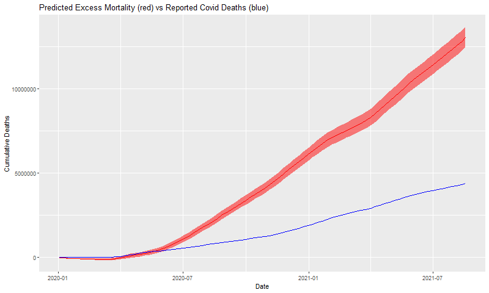

# The Economist's excess deaths model
This repository contains the replication code and data for The Economist's excess deaths model, used to estimate the true death toll of the covid-19 pandemic. This model has been updated, mainly around missing data imputation to use weighted mean imputation and linear interpolation.

  
  
To replicate the model and export estimated excess deaths for a locality, please run the scripts 1, 2, and 3, in the scripts folder. As the model draws most of its data dynamically, you can use these scripts to generate updated estimates as time passes. Script 2.5 generates some calibration plots so that the quality of the estimates can be examined. 0 downloads data available online, the only files not updated by this are the *econ_df* names file and the **sero_tracker** data, where a csv must be manually requested and downloaded.
  

To read about what the model shows, see our [Briefing: Counting the dead.](https://www.economist.com/briefing/2021/05/15/there-have-been-7m-13m-excess-deaths-worldwide-during-the-pandemic)     

To understand how we constructed it, see our [Methodology: How we estimated the true death toll of the pandemic.](https://www.economist.com/ExcessDeathsModel)   

  
A special thanks to all our sources and to those who have made the data to create these estimates available. We list all our sources in our methodology. Within script 1, the source for each variable is also given as the data is loaded, with the exception of our sources for excess deaths data, which we detail in on our free-to-read [excess deaths tracker](https://www.economist.com/graphic-detail/coronavirus-excess-deaths-tracker). The gradient booster implementation used to fit the models is aGTBoost, detailed [here.](https://arxiv.org/abs/2008.05926)
